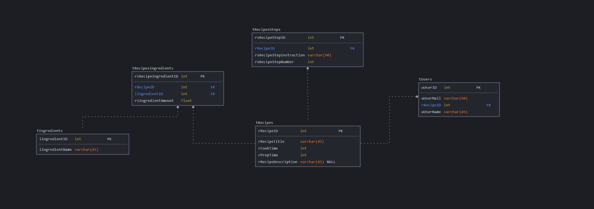

       EPSI ASRBD B3C2

<ul>
  <li>GUARDABASSI Jérémy</li>
  <li>MAROT Damien</li>
  <li>PARRAMON-DARNE Louis</li>
  <li>POTTS Nastasia</li>
</ul> 

**Pré-Requis:** Docker + Docker-Compose  

Interface PHPMyAdmin disponible sur le port :8081  

Site web et l'application sur le port :8080  

# Démarrer l'appli et la base de données

    docker-compose up -d

# Tests d’acceptance techniques

Etant donné que le système livré comporte deux images : la base de données avec
son schéma de base de données, et l’application. :heavy_check_mark:

Je dois pouvoir créer un container à partir de l’image Docker de cette base de
données, puis un autre container à partir de l’image de l’application. :heavy_check_mark:

Après exécution de l’application, celle-ci doit pouvoir répondre à toutes les
opérations de CRUD déclenchées par l’opérateur. :heavy_check_mark:

Si le test est concluant, le projet est validé. :heavy_check_mark:

# Contraintes techniques

Les recettes sont stockées dans une BDD MySQL 8.0 :heavy_check_mark:

L’application est codée dans le langage de votre choix. :heavy_check_mark:

Les données stockées dans la base doivent être persistées (au sens Docker). :heavy_check_mark:

